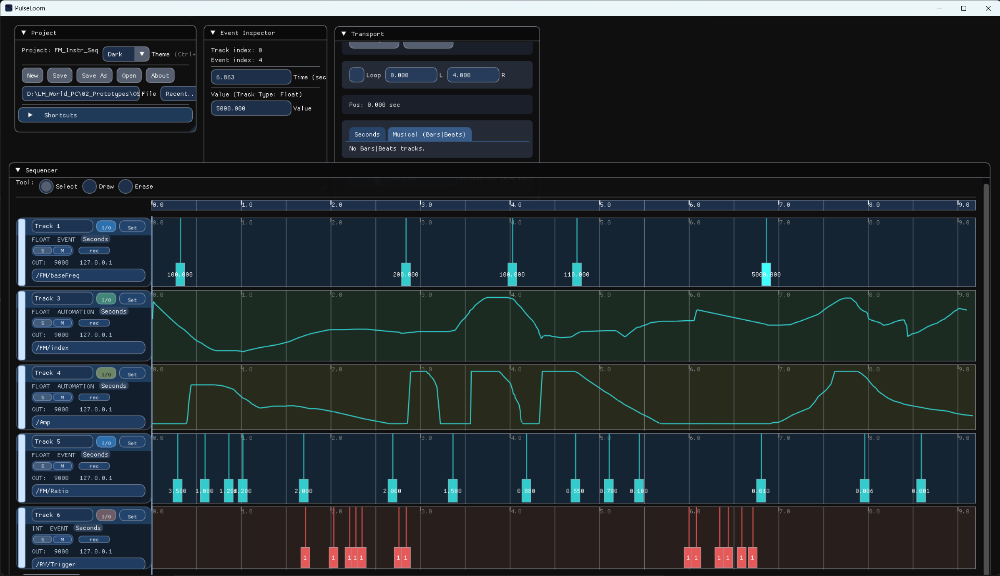

# PulseLoom (OSC Sequencer)

Standalone desktop tool for sequencing OSC control data over time — for experimental music, modular/interactive setups, and custom audio workflows.

**Download (Windows, v0.210):** https://github.com/live-a11y/PulseLoom/releases/tag/v0.210  
**Repository / Docs:** https://github.com/live-a11y/PulseLoom

## What it does
PulseLoom helps you design and play back control timelines (curves/events) that drive external engines via OSC.
It sits between your ideas and your sound engine (Max/Csound/SuperCollider/etc.) as a focused control layer.

## Key features
- Track-based sequencing (multiple lanes / targets)
- Automation-style curves for smooth parameter changes
- Per-track OSC routing (target / port / address)
- MIDI input control (external controllers to drive/modify actions/parameters)
- Session save/load for repeatable setups

