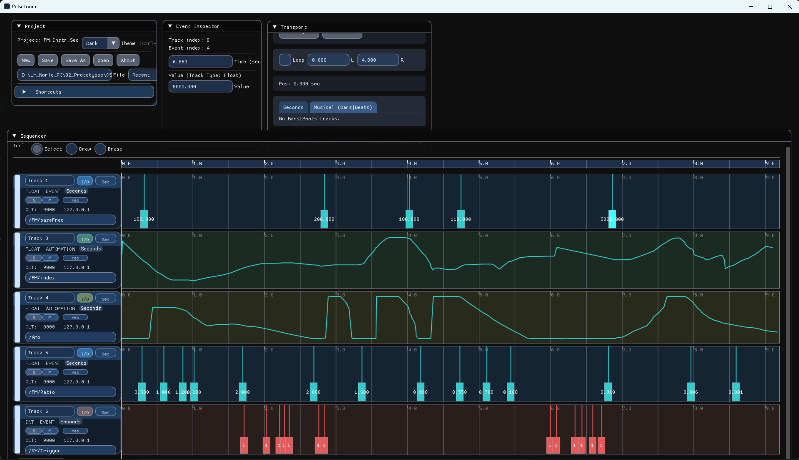

# PulseLoom (OSC Sequencer)

Standalone desktop tool for sequencing OSC control data over time — for experimental music, modular/interactive setups, and custom audio workflows.

PulseLoom is part of Liu Hao's personal software and music technology archive, which includes iOS music tools, audiovisual systems, creative coding projects, and experimental control software.

## Links

* **Official website:** https://liuhao-art.com/
* **Apps & Systems archive:** https://liuhao-art.com/apps/apps.html
* **Download (Windows, v0.210):** https://github.com/live-a11y/PulseLoom/releases/tag/v0.210
* **Repository / Docs:** https://github.com/live-a11y/PulseLoom

## What it does

PulseLoom helps you design and play back control timelines, curves, and events that drive external engines via OSC.

It sits between your ideas and your sound engine — such as Max/MSP, Csound, SuperCollider, etc. — as a focused control layer for experimental music and interactive audiovisual work.

## Key features

* Track-based sequencing with multiple lanes and targets
* Automation-style curves for smooth parameter changes
* Per-track OSC routing, including target host, port, and OSC address
* MIDI input control for external controllers
* Session save/load for repeatable setups
* Designed for experimental music, modular/interactive systems, and custom audio workflows
